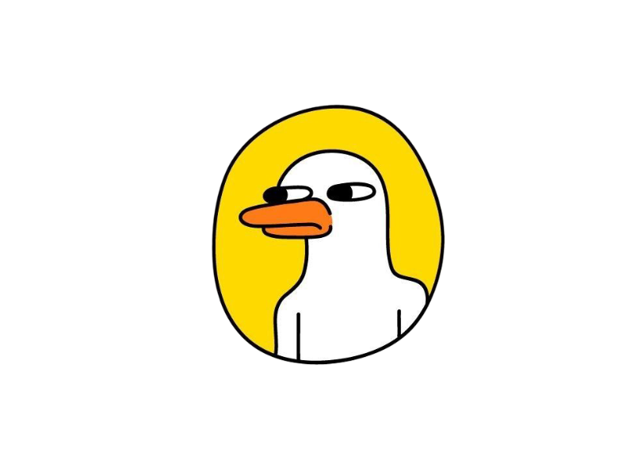

```ascii
               d8b                                       
               88P                      d8P              
              d88                    d888888P            
?88,.d88b,    888       d888b8b        ?88'       d8888b 
`?88'  ?88    ?88      d8P' ?88        88P       d8P' ?88
  88b  d8P     88b     88b  ,88b       88b       88b  d88
  888888P'      88b    `?88P'`88b      `?8b      `?8888P'
  88P'                                                   
 d88                                                     
 ?8P    
```

> *A platypus approach to research knowledge graphs.*

**PLATO** is a local-first **Context Preparation Assistant** for independent researchers, product managers, and developers. Like the platypus—a unique hybrid of different animals—PLATO combines **PDF processing**, **Vector Search**, and **Knowledge Graphs** into one cohesive tool.

an intelligent local-first document processor that creates
  structured knowledge for you to chat with and use in other projects.


## Why "PLATO"?
Just as the platypus is one of nature's most unique creatures, your research deserves a unique approach. We don't try to build a "genius AGent" that does the thinking for you. Instead, we use lightweight (1B) models to **prepare the context** so *you* (or a larger model) can do the deep work.

- 🦫 **Hybrid Intelligence**: Vector search + Knowledge graphs.
- 🏠 **Privacy-first**: All processing happens locally on your machine (via Ollama).
- 🧩 **The Contexter Pattern**: Efficient resource management for your PDFs and models.
- ⚡ **Lightweight**: Optimized for consumer hardware (M1/M2 Macs with 8GB RAM).

## The Workflow
1.  **Scan**: Dump your PDFs into a folder.plato scans them using a fast 1B model to understand what they are.
2.  **Suggest**: The agent looks at your collection and suggests workflows (e.g., "Build a comparison table," "Extract timeline").
3.  **Build**: You approve, and plato constructs a structured `context.md` file properly 

> A local-first, schema-driven knowledge extraction tool.

**Platograph** is an intelligent document processor designed for researchers, developers, and product managers. It creates a local, self-hosted knowledge base from your documents and lets you interact with it through a conversational chat interface, all powered by local LLMs via Ollama.

The goal of plato is to provide a frictionless, "plug and play" experience for turning a folder of documents into a queryable knowledge graph.

## Core Features

- **🏠 Local First & Private**: All processing and data storage happens on your machine. Your documents never leave your computer.
- **🧠 Intelligent Extraction**: Uses local LLMs to build a knowledge graph and vector index from your documents, enabling both semantic search and structured queries.
- **💬 Conversational Interface**: Use the `chat` command to ask questions and get answers directly from your knowledge base.
- **🧩 Simple & File-Based**: No external databases or complex setup required. The knowledge graph is stored in your project directory.
- **📊 Visualization**: Automatically generate interactive knowledge graph diagrams (Mermaid, GraphViz) to see connections in your data.
- **📝 Context Export**: Export your knowledge base to structured Markdown (`context.md`) specially formatted for LLM context windows.
- **⚙️ Configurable Models**: Easily configure which Ollama models to use for different tasks (e.g., a powerful model for extraction, a fast model for chat).

## Quick Start

**1. Prerequisites**

Ensure you have [Ollama](https://ollama.com) installed and running.

**2. Install Models**

Pull the default models thatplato uses. You can change these later in `config.yaml`.

```bash
ollama pull lfm2.5-thinking
ollama pull qwen2.5-coder:3b
ollama pull deepseek-ocr
ollama pull nomic-embed-text
ollama pull dolphin-phi
```

**3. Installplato**

Clone the repository and install it in editable mode.

```bash
git clone <repository_url>
cd plato
pip install -e .
```

**4. Process Your Documents**

Place your documents (PDFs, etc.) into a directory (e.g., `my_papers/`) and run the `process` command.

```bash
plato process ./my_papers/
```

Platograph will read the documents, build the knowledge graph, and store it locally in the `./storage` directory.

**5. Chat With Your Knowledge**

Start a conversation with your newly created knowledge base.

```bash
plato chat
```

---

## Command Reference

### `plato process <directory> [--concurrency N]`

This is the core command for ingesting documents.

- **`directory`**: Path to the directory containing your documents.
- **`--concurrency N`**: (Optional) Number of concurrent files to process. Defaults to 2. Use 1 for low-RAM devices, 4+ for M1/M2/M3.

### `plato chat`

Starts an interactive chat session with the knowledge base you've built.

- Ask questions in natural language.
- Type `exit` or `quit` to end the session.

### `plato visualize`

Generates an interactive visualization of your knowledge graph.

- **`--format`**: Output format (`mermaid`, `graphviz`, `json`). Defaults to `mermaid`.
- **`--limit N`**: Max nodes to display (default 50).
- Opens an HTML file with the interactive graph.

### `plato export`

Exports the knowledge base for external use.

- **`--format`**: Output format (`markdown`, `json`). Defaults to `markdown`.
- Generates a `context.md` file ideal for pasting into LLM prompts.

---

## 🗺️ Roadmap & Backlog

See [BACKLOG.md](BACKLOG.md) for our detailed roadmap, including planned features like Entity Resolution, Deep Search, and UI improvements.

---
*Built with ❤️ for the curious.*