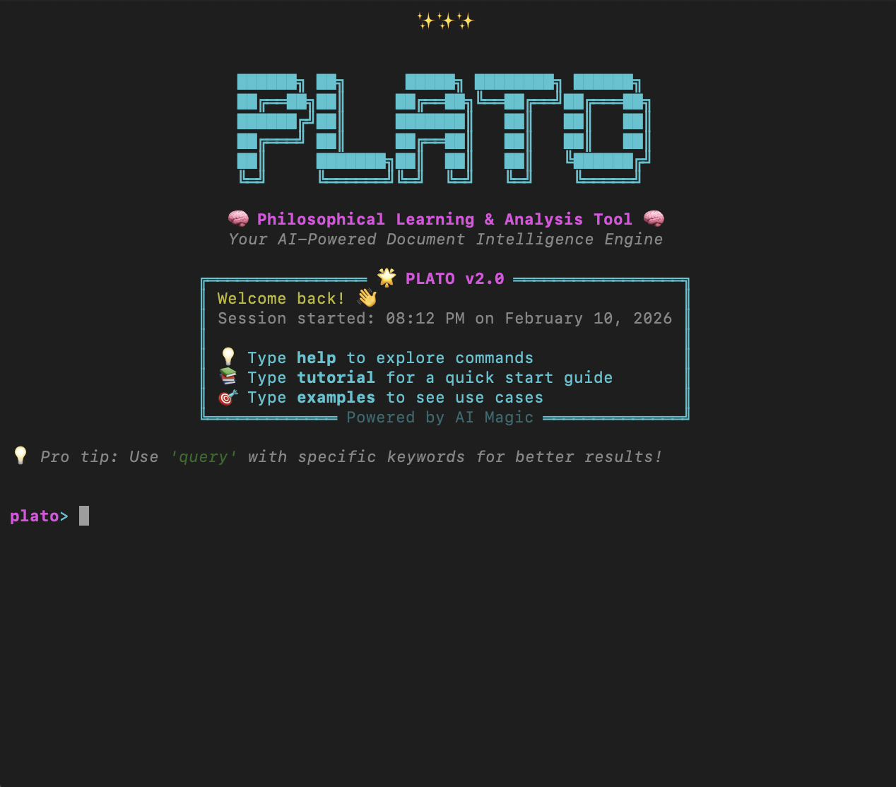

```ascii
 ██████╗ ██╗      █████╗ ████████╗ ██████╗ 
 ██╔══██╗██║     ██╔══██╗╚══██╔══╝██╔═══██╗
 ██████╔╝██║     ███████║   ██║   ██║   ██║
 ██╔═══╝ ██║     ██╔══██║   ██║   ██║   ██║
 ██║     ███████╗██║  ██║   ██║   ╚██████╔╝
 ╚═╝     ╚══════╝╚═╝  ╚═╝   ╚═╝    ╚═════╝ 
```

> **PLATO**: A local-first, CLI-driven Research Assistant for independent scholars.

**PLATO** is a specialized tool for bridging the gap between static PDFs and AI-ready context. Unlike generic "Chat with PDF" tools, PLATO focuses on **auditable, local workflows**—summarizing, indexing, and extracting insights using lightweight models via Ollama.

## 🦫 Why PLATO?

- **Local-First & Private**: All processing happens on your machine. No cloud APIs.
- **CLI Powerhouse**: A rich terminal interface for rapid `process`, `query`, and `insights` commands.
- **Lightweight RAG**: Uses a custom NumPy-based vector store (no heavy vector DBs) for blazing fast, low-overhead search.
- **Model Agnostic**: Optimized for `embeddinggemma` (Google) and `qwen2.5-coder` (Alibaba), but configurable via Ollama.
- **Philosophical Roots**: Named after the philosopher, aiming for wisdom through structured inquiry.

## 🖥️ The Interface

PLATO offers two modes:
1. **Interactive Shell (REPL)**: The primary way to interact. Type `plato --chat` to enter.
2. **Textual App (TUI)**: A visual file browser and dashboard (Legacy/Experimental).



## 🚀 Quick Start

### 1. Prerequisites
Install [Ollama](https://ollama.com) and pull the core models:

```bash
# Required for Embeddings
ollama pull embeddinggemma:latest

# Required for Reasoning (Choose one based on your RAM)
ollama pull qwen2.5-coder:1.5b  # For 8GB RAM
ollama pull qwen2.5-coder:3b    # For 16GB+ RAM
```

### 2. Installation
```bash
git clone <repository_url>
cd plato
pip install -e .
```

### 3. Launch the Shell
Enter the interactive research environment:
```bash
python3 src/plato/main.py --chat
```

### 4. Basic Usage
Once inside the shell:
```bash
# Index a PDF or directory
plato> process ./my_papers/

# Search your knowledge base
plato> query "What is the primary conclusion?"

# Generate a markdown report
plato> insights report.md
```

## 🛠️ Configuration

Edit `src/plato/config.py` or sets evironment variables to customize your experience:
- `OLLAMA_HOST`: Point to a remote Ollama instance.
- `PIPELINE_OUTPUT_DIR`: Change where your index is stored.

---
*Built for the pursuit of knowledge, not just information.*